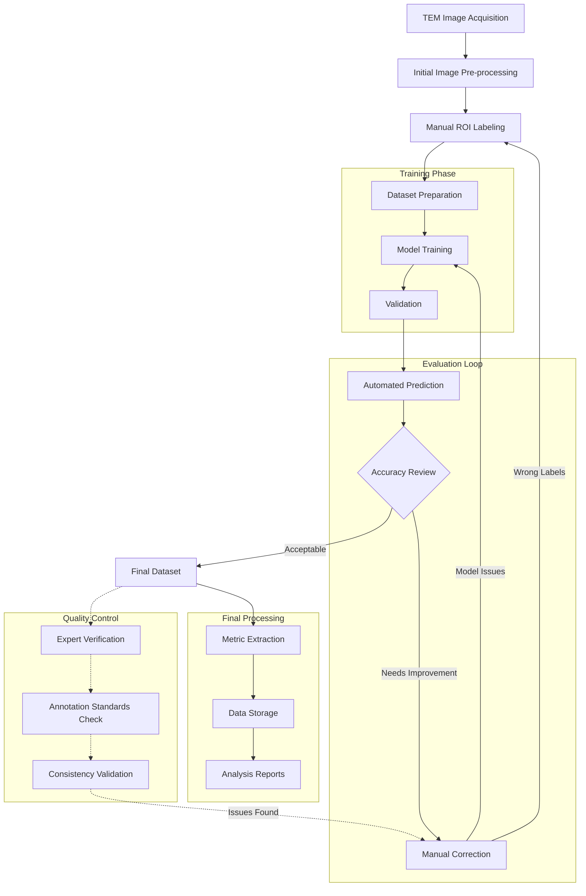

# OrganelleVision

## Overview
OrganelleVision is a specialized software toolkit for automating transmission electron microscopy (TEM) workflow, specifically designed for organelle identification and analysis. This project focuses on the automated detection and analysis of cellular organelles, with particular emphasis on mitochondria and vesicles in rodent ileum tissue samples.

## Features
- Automated TEM workflow processing
- Specialized organelle detection algorithms
- Annotation metric extraction automation
- High-quality dataset management
- Manual annotation verification system

## Dataset Specifications
- **Size**: 2000+ Regions of Interest (ROIs)
- **Source Tissue**: Ileum samples from mice and rats
- **Primary Focus**: 
  - Mitochondria
  - Vesicles
- **Quality Assurance**: Hand-supervised and verified annotations
- **Validation**: Expert-reviewed data

## Technical Details

### Data Processing Pipeline

### Annotation Process
- Manual supervision of annotations
- Expert verification
- Quality control checkpoints
- Standardized validation protocols

## Development Status
Currently under active development and not open source.

### Ongoing Development
- Code refactoring for improved maintainability
- Implementation of object-oriented design patterns
- Modularization of components
- Enhanced inter-module communication
- Comprehensive dataset evaluation tools

### Roadmap
- [ ] Complete code refactoring
- [ ] Implement class-based architecture
- [ ] Modularize core functionalities
- [ ] Develop inter-module communication protocols
- [ ] Create dataset evaluation framework

## Research Applications
This toolkit has been developed in conjunction with research published in Frontiers in Physiology. The associated research demonstrates its effectiveness in analyzing cellular structures in rodent tissue samples.

### Key Research Outcomes
- Automated identification of cellular organelles
- Quantitative analysis of organelle characteristics
- Standardized workflow for TEM image processing
- Validated methodology for tissue analysis

## Future Development
- Enhanced automation capabilities
- Extended organelle recognition
- Integration with other microscopy platforms
- Public dataset release
- API development

## Technical Requirements
(To be added when the project becomes open source)

## Installation
(To be added when the project becomes open source)

## Usage
(To be added when the project becomes open source)

## Contributing
Currently, this project is not open for external contributions. Future updates will include contribution guidelines when the project becomes open source.

## License
(To be determined)

## Contact
(Add appropriate contact information)

## Acknowledgments
- Research team and contributors
- Associated research institutions
- Funding sources

---

**Note**: This documentation is a work in progress and will be updated as the project develops and moves towards open-source status.